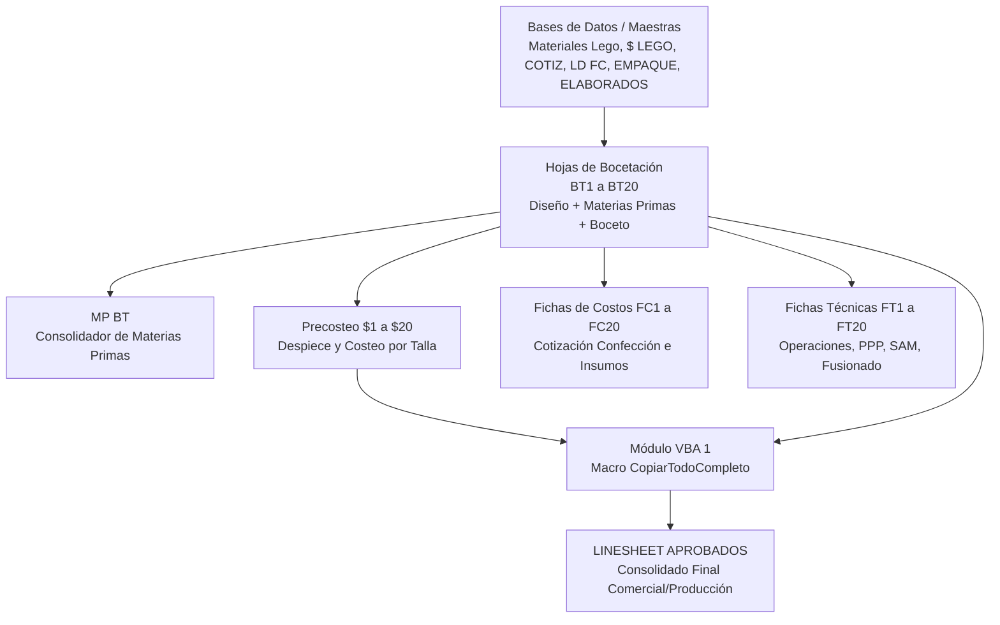
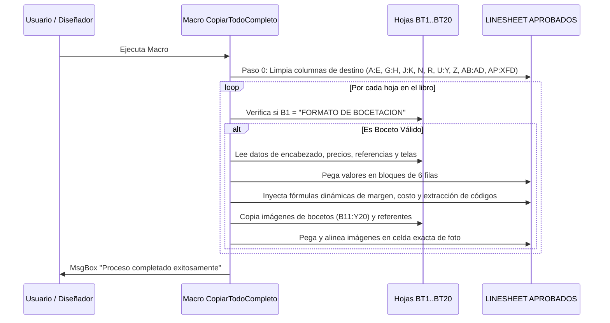

# Análisis Estructural, Fórmulas, Macros y Mapeo de Llenado Manual
**Archivo:** `PLANTILLA BOCETACION_FC_FT NVA C3-6 2026.xlsm`  
**Propósito del Libro:** Sistema integral de diseño de moda, costeo de prendas, generación de fichas técnicas y consolidación en Linesheet para Azzorti / Dupree (Campaña C3-6 2026).

---

## 1. Arquitectura General del Libro de Excel

El libro cuenta con un total de **89 hojas de cálculo**, organizadas en un flujo de trabajo maestro que conecta diseño, costeo, ingeniería de producto y comercial:

### Clasificación de las 89 Hojas

| Categoría | Cantidad | Hojas | Estado de Visibilidad | Propósito Principal |
| :--- | :---: | :--- | :---: | :--- |
| **Consolidación Linesheet** | 2 | `LINESHEET IMPORTADOS` `LINESHEET APROBADOS` | Visible | Resumen catálogo consolidado con fotos, precios, costos y márgenes de los productos aprobados. |
| **Bases de Datos & Maestras** | 7 | `ELABORADOS` `Materiales Lego` `$ LEGO` `COTIZ` `LD FC` `EMPAQUE` `MP BT` | 3 Visibles 4 VeryHidden | Catálogo de insumos SAP, matrices de precios, listas desplegables, especificaciones de telas y puente de materias primas. |
| **Bocetación (Diseño)** | 20 | `BT1` a `BT20` | Visible | Ficha de entrada para el Diseñador: boceto gráfico, especificaciones de prendas 1-6, telas, colores y consumos. |
| **Precosteo Detallado** | 20 | `$1` a `$20` | VeryHidden | Cálculo detallado de costo unitario por talla, hilos, insumos, mano de obra y empaque. |
| **Fichas de Costos** | 20 | `FC1` a `FC20` | VeryHidden | Ficha de costos estándar para producción, confección y negociación con talleres. |
| **Fichas Técnicas** | 20 | `FT1` a `FT20` | VeryHidden | Ficha de ingeniería: balance de línea, operaciones de confección/fusionado, tiempos SAM y maquinaria. |

---

## 2. Análisis Hoja por Hoja

### 2.1 Hojas de Consolidación (Linesheet)

#### `LINESHEET APROBADOS` (Visible)
- **Para qué sirve:** Es el entregable comercial y directivo del equipo de diseño. Consolida en bloques horizontales de 6 filas por producto toda la información clave: Referencia, Diseñador, Fotos vinculadas, Grupo, Silueta, Proveedor, Precios de Venta (PVP Catálogo, Precio Escala), Costos, Descuentos y Margen de contribución.
- **Fórmulas clave:**
  - `N3`: `=IFERROR(M3/L3,0)` (Cálculo de margen o factor multiplicador).
  - `Z3`: `=R3-T3` (Diferencial o utilidad bruta entre precio de venta y costo).
  - `AI3`: `=IFERROR(LEFT(AG3,FIND("T-",AG3,1)-2),"")` (Extracción de código de tela antes del sufijo de taller).
  - `AJ3`: `=IFERROR(RIGHT(AG3,LEN(AG3)-FIND("T-",AG3,1)+1),"")` (Extracción de código de taller/trazo).
- **Relación con Macros:** Es la hoja de destino de la macro `CopiarTodoCompleto()`.

#### `LINESHEET IMPORTADOS` (Visible)
- **Para qué sirve:** Ficha de seguimiento específica para productos adquiridos como paquete completo o importados directamente, conservando la misma estructura de costeo que el linesheet nacional.
- **Fórmulas:** Idénticas a las de `LINESHEET APROBADOS` (`M/L`, `R-T`, extracción de cadenas).

---

### 2.2 Hojas Maestras y Bases de Datos de Soporte

#### `ELABORADOS` (Visible)
- **Para qué sirve:** Diccionario maestro de textos comerciales para el catálogo. Define para cada tipo de tejido su composición oficial, construcción de tela, texto publicitario ("Elaborado en..."), beneficios ergonómicos e infografía.
- **Fórmulas:** No contiene fórmulas; es una base de datos estática de texto consultada por fórmulas matriciales en las hojas `BT`.

#### `Materiales Lego` (Visible)
- **Para qué sirve:** Maestro de artículos de insumos (código SAP numérico de 7 dígitos como `6000007`, `6002536`, descripción técnica, clase de adorno/insumo y bandera LEGO).
- **Fórmulas:**
  - `C327`: `=TRIM(MID(SUBSTITUTE(B327," ",REPT(" ",100)),2*100+1,100))` (Fórmula para extraer la segunda palabra de la descripción técnica).

#### `$ LEGO` (VeryHidden)
- **Para qué sirve:** Matriz de precios unitarios oficiales y porcentaje de desperdicio por insumo LEGO para precosteo.
- **Fórmulas:**
  - `B2`: `=UPPER(LEFT(A2,FIND(" ",A2,1)))` (Extracción de tipo de insumo).
  - Encadenamiento de precios: `=+E6`.

#### `COTIZ` (VeryHidden)
- **Para qué sirve:** Base de datos de cotizaciones vigentes por material, con fecha de validez y costo final negociado (`$Final`).
- **Fórmulas:** Tabla estática importada de SAP/compras.

#### `LD FC` (VeryHidden)
- **Para qué sirve:** "Listas Desplegables de Ficha de Costos". Almacena los rangos dinámicos que alimentan los menús desplegables de las hojas de bocetación y fichas de costo (siluetas, cuellos, mangas, anchos de bota, tiros, etc.).
- **Fórmulas:**
  - `BS2`: `=VLOOKUP(BR2,Sheet1__2[[Material]:[Texto breve de material]],2,0)` (Búsqueda cruzada de textos breves de material).

#### `EMPAQUE` (Visible)
- **Para qué sirve:** Parámetros de ingeniería de corte y patronaje por tipo de tela: ancho efectivo, elasticidad a lo largo y ancho, encogimiento térmico, peso por m² y tabla de bolsas de empaque recomendadas.

#### `MP BT` (VeryHidden)
- **Para qué sirve:** Puente de consolidación de Materias Primas por cada Boceto. Lee directamente de `BT1` a `BT20` y de `$1` a `$20` para estructurar la lista plana de materiales que alimentará las Fichas de Costo.
- **Fórmulas:**
  - `C2`: `=+'BT1'!AN1` (Número de referencia).
  - `D2`: `='BT1'!D3&" "&'BT1'!H3&" "&'BT1'!AN1` (Nombre completo compuesto).
  - `E2:G2`: `=+'$1'!C10`, `=+'$1'!D10`, `=+'$1'!J10` (Código, descripción y consumo de precosteo).

---

### 2.3 Hojas de Trabajo por Producto (Bloques 1 al 20)

Existen 20 bloques idénticos (numerados del 1 al 20). Cada bloque consta de 4 hojas:

#### 1. `BT1` a `BT20` — Formato de Bocetación (Visible)
- **Para qué sirve:** Es la interfaz principal del diseñador. Permite definir la silueta, ingresar códigos SAP de telas, seleccionar acabados, registrar medidas de hasta 6 prendas por paquete/conjunto, ubicar consumos por pieza y pegar bocetos e imágenes de muestra.
- **Fórmulas clave:**
  - Búsqueda de descripción de telas en `$ LEGO`: `=IFERROR(VLOOKUP(B24,'$ LEGO'!A:E,2,0),0)`.
  - Búsqueda de anchos útiles en `LD FC`: `=IFERROR(VLOOKUP(AQ24,'LD FC'!DR:DZ,9,0),0)`.
  - Extracción de nombres cortos de tela: `=IFERROR(IF(LEFT(D24,4)="TELA",LEFT(REPLACE(D24,1,9,""),FIND(" ",REPLACE(D24,1,9,""),1)),LEFT(D24,FIND(" ",D24,1))),0)`.
  - Elaborados automáticos de catálogo: `=IFERROR(IF(AND(AC4<>"",SUMPRODUCT(...)>0), ...), "")`.

#### 2. `$1` a `$20` — Ficha Técnica de Precosteo (VeryHidden)
- **Para qué sirve:** Realiza el desglose económico de costo directo de materiales, telas por color/talla, insumos, marquillas, etiquetas, empaque y mano de obra.
- **Fórmulas:** Sumas ponderadas de tela `=+D24*Q24`, enlaces a `BT` (`=+'BT1'!AN1`), consolidación de costo final `=+L141`.

#### 3. `FC1` a `FC20` — Ficha de Costos de Confección (VeryHidden)
- **Para qué sirve:** Matriz técnica para compras y auditoría de costos de confección industrial por lote.

#### 4. `FT1` a `FT20` — Ficha Técnica de Ingeniería y Fusionado (VeryHidden)
- **Para qué sirve:** Hoja de control de operaciones de confección, balance de línea, accesorios de máquina, valor PPP (Precio Por Pieza) y SAM (Minutos Estándar Permitidos):
  - `AA3`: `=IF(X3>0,W3*X3,0)` (SAM total por operación).
  - `AC3`: `=+X3*V3` (Costo total de la operación por lote).

---

## 3. Análisis Completo de Macros (VBA)

El archivo contiene dos módulos principales de código VBA:

### 3.1 `Módulo1`: Sub `CopiarTodoCompleto()`
**Objetivo:** Automatizar la consolidación de todos los bocetos aprobados hacia la hoja `LINESHEET APROBADOS`.

#### Funciones Auxiliares en `Módulo1`:
1. `ObtenerValorSeguro(ws, rango)`: Lee celdas individuales o combinadas evitando errores si la celda está vacía.
2. `CombinarYCopiar(wsDestino, rango)`: Realiza combinación de celdas segura sin perder formatos.
3. `EliminarImagenesEnRango(ws, rango)`: Borra imágenes previas en el Linesheet para evitar superposición.
4. `PegarComoVinculo(...)`: Pega las imágenes de modelación y bocetos en alta fidelidad.
5. `Factor()`: Macro complementaria para recalcular factores de precio/costo en columnas U a Y.

---

### 3.2 `Módulo2`: Sub `AlternarHojas()`
**Objetivo:** Conmutador rápido de visibilidad para el usuario.
- Si las hojas `$1..$20`, `FC1..FC20`, `FT1..FT20`, `$ LEGO`, `COTIZ` y `LD FC` están ocultas (`xlSheetVeryHidden`), la macro las hace visibles para permitir auditoría técnica de costos.
- Si están visibles, las vuelve a ocultar para mantener limpia la interfaz del diseñador, dejando activas solo las hojas `BT` y `LINESHEET`.

---

## 4. Mapeo Exhaustivo de Celdas de Llenado Manual

Contrastando celda por celda la hoja `BT1` (plantilla idéntica para `BT1` a `BT20`) con el pantallazo suministrado por el usuario, a continuación se presenta el **mapeo 100% exacto** de todas las celdas donde se debe ingresar información de forma manual (colores Verde `#E2EFDA` / `FFE8FEB8`, Amarillo `#FFF2CC` y zonas de entrada libre).

---

### SECCIÓN 1: Encabezado Superior (Datos Generales del Producto)

| Rango / Celda | Etiqueta / Nombre del Campo | Tipo de Entrada | Color en Pantalla | Descripción / Opciones |
| :--- | :--- | :---: | :---: | :--- |
| **`K2:N3`** | **SILUETA / FOTOS SILUETA** | Lista Desplegable | Verde Claro | Tipo de silueta (Camiseta, Blusa, Vestido, Enterizo, Pantalón, etc.). |
| **`X2:Z3`** | **TALLAS / TALLES** | Lista Desplegable | Verde Claro | Rango de tallas comerciales (ej: `XS-S-M-L-XL`, `6-8-10-12-14`). |
| **`AA2:AC3`** | **OBJETIVO** | Texto Libre | Blanco / Gris | Objetivo de venta o público meta de la prenda. |
| **`D4:E5`** | **CAMPAÑA** | Manual / Número | Verde Claro | Número de campaña catálogo (ej: `C-03`, `C-04`, `C-05`, `C-06`). |
| **`H4:K5`** | **PROYECTO** | Texto Libre | Verde Claro | Nombre del proyecto, cápsula o temática de diseño. |
| **`L4:M5`** | **TEXTO CONSTRUCCIÓN** | Texto Libre | Blanco | Detalles constructivos o descripción de confección. |
| **`S4:U5`** | **DESCRIPCIÓN / TEXTO** | Texto Libre | Verde Claro | Descripción extendida para diseño. |
| **`AC4:AE5`** | **MODIFICADO PRENDA 1** | Lista Desplegable | Verde Claro | Indicador de modificación o base para Prenda 1. |
| **`AH4:AJ5`** | **MODIFICADO PRENDA 2** | Lista Desplegable | Verde Claro | Indicador de modificación o base para Prenda 2. |
| **`AM4:AO5`** | **MODIFICADO PRENDA 3** | Lista Desplegable | Verde Claro | Indicador de modificación o base para Prenda 3. |
| **`AC5:AE5`** | **SILUETA 1** | Lista Desplegable | Verde Claro | Silueta específica Prenda 1. |
| **`AH5:AJ5`** | **SILUETA 2** | Lista Desplegable | Verde Claro | Silueta específica Prenda 2. |
| **`AM5:AO5`** | **SILUETA 3** | Lista Desplegable | Verde Claro | Silueta específica Prenda 3. |
| **`AC6:AE6`** | **ATRIBUTO 1** | Lista Desplegable | Verde Claro | Atributo principal de diseño (Prenda 1). |
| **`AH6:AJ6`** | **ATRIBUTO 2** | Lista Desplegable | Verde Claro | Atributo principal de diseño (Prenda 2). |
| **`AM6:AO6`** | **ATRIBUTO 3** | Lista Desplegable | Verde Claro | Atributo principal de diseño (Prenda 3). |
| **`AC7:AE7`** | **TEJIDO 1** | Lista Desplegable | Verde Claro | Tipo de tejido (Punto, Plano, Denim, etc. Prenda 1). |
| **`AH7:AJ7`** | **TEJIDO 2** | Lista Desplegable | Verde Claro | Tipo de tejido (Prenda 2). |
| **`AM7:AO7`** | **TEJIDO 3** | Lista Desplegable | Verde Claro | Tipo de tejido (Prenda 3). |

---

### SECCIÓN 2: Especificaciones Técnicas por Prenda (Prendas 1 a 6)
Ubicadas en la esquina superior derecha (Filas 1 a 10, Columnas `AP` a `DC`). Bloques de color Amarillo/Verde claro:

#### Prenda 1 (`AP1:AZ10`)
| Campo | Rango Etiqueta | Rango Entrada Manual | Tipo de Control |
| :--- | :--- | :--- | :---: |
| **Largo Prenda (Superior)** | `AQ2:AU2` | **`AV2:AZ2`** | Lista Desplegable / Valor |
| **Tipo de Escote** | `AQ3:AU3` | **`AV3:AZ3`** | Lista Desplegable (Cll Redondo, V, Bandeja, etc.) |
| **Tipo de Cuello** | `AQ4:AU4` | **`AV4:AZ4`** | Lista Desplegable (Camisero, Nerú, Tortuga, etc.) |
| **Tipo de Manga** | `AQ5:AU5` | **`AV5:AZ5`** | Lista Desplegable (Corta, 3/4, Larga, Sisa, Rango) |
| **Largo Prenda (Inferior)** | `AQ7:AU7` | **`AV7:AZ7`** | Lista Desplegable / Valor |
| **Ancho de Bota** | `AQ8:AU8` | **`AV8:AZ8`** | Lista Desplegable (Pitillo, Recto, Bota Campana, etc.) |
| **Tiro** | `AQ9:AU9` | **`AV9:AZ9`** | Lista Desplegable (Alto, Medio, Descaderado) |

#### Prenda 2 (`BA1:BK10`)
| Campo | Rango Entrada Manual | Tipo de Control |
| :--- | :--- | :---: |
| **Largo Prenda Sup / Escote / Cuello / Manga** | **`BG2:BK2`**, **`BG3:BK3`**, **`BG4:BK4`**, **`BG5:BK5`** | Listas Desplegables |
| **Largo Inf / Bota / Tiro** | **`BG7:BK7`**, **`BG8:BK8`**, **`BG9:BK9`** | Listas Desplegables |

#### Prenda 3 (`BM1:BV10`)
| Campo | Rango Entrada Manual | Tipo de Control |
| :--- | :--- | :---: |
| **Largo Prenda Sup / Escote / Cuello / Manga** | **`BR2:BV2`**, **`BR3:BV3`**, **`BR4:BV4`**, **`BR5:BV5`** | Listas Desplegables |
| **Largo Inf / Bota / Tiro** | **`BR7:BV7`**, **`BR8:BK8`**, **`BR9:BV9`** | Listas Desplegables |

#### Prenda 4 (`BX1:CG10`)
| Campo | Rango Entrada Manual | Tipo de Control |
| :--- | :--- | :---: |
| **Largo Prenda Sup / Escote / Cuello / Manga** | **`CC2:CG2`**, **`CC3:CG3`**, **`CC4:CG4`**, **`CC5:CG5`** | Listas Desplegables |
| **Largo Inf / Bota / Tiro** | **`CC7:CG7`**, **`CC8:CG8`**, **`CC9:CG9`** | Listas Desplegables |

#### Prenda 5 (`CI1:CR10`)
| Campo | Rango Entrada Manual | Tipo de Control |
| :--- | :--- | :---: |
| **Largo Prenda Sup / Escote / Cuello / Manga** | **`CN2:CR2`**, **`CN3:CR3`**, **`CN4:CR4`**, **`CN5:CR5`** | Listas Desplegables |
| **Largo Inf / Bota / Tiro** | **`CN7:CR7`**, **`CN8:CR8`**, **`CN9:CR9`** | Listas Desplegables |

#### Prenda 6 (`CT1:DC10`)
| Campo | Rango Entrada Manual | Tipo de Control |
| :--- | :--- | :---: |
| **Largo Prenda Sup / Escote / Cuello / Manga** | **`CY2:DC2`**, **`CY3:DC3`**, **`CY4:DC4`**, **`CY5:DC5`** | Listas Desplegables |
| **Largo Inf / Bota / Tiro** | **`CY7:DC7`**, **`CY8:DC8`**, **`CY9:DC9`** | Listas Desplegables |

---

### SECCIÓN 3: Datos de Proveedor, Rol y Logística

| Rango / Celda | Etiqueta | Tipo de Entrada | Color | Descripción |
| :--- | :--- | :---: | :---: | :--- |
| **`AV12:AZ13`** | **PROVEEDOR** | Texto / Lista | Verde Claro | Nombre o código de taller/proveedor de confección. |
| **`AV14:AZ15`** | **ROL DE REFERENCIA** | Texto / Lista | Verde Claro | Rol del producto (Básico, Moda, Vanguardia, etc.). |

---

### SECCIÓN 4: Área Central de Bocetos, Referentes y Comentarios (Gráficos)

| Rango de Celdas | Etiqueta / Nombre | Tipo de Contenido | Notas de Uso |
| :--- | :--- | :---: | :--- |
| **`B11:Y20`** | **ÁREA DE BOCETO / DIBUJO TÉCNICO** | Gráfico / Pegado de Imagen | Aquí se inserta el dibujo técnico plano (frente/espalda) de la prenda. La macro lo lee y copia a Linesheet. |
| **`AA9:AH14`** | **REFERENTES** | Gráfico / Pegado de Imagen | Imagen de muestra física o referente de moda internacional. |
| **`AA16:AH21`** | **TRAZO MUESTRA** | Gráfico / Pegado de Imagen | Foto del trazo de corte o encaje de piezas. |
| **`AI9:AO21`** | **COMENTARIOS INGENIERÍA / MUESTRA** | Texto Multilínea Libre | Observaciones técnicas de confección, costuras o pruebas de lavado. |

---

### SECCIÓN 5: Tabla de Telas y Materias Primas por Color (Filas 22 a 33)

Esta tabla contiene 10 filas de insumos por color (`Filas 24 a 33`).

#### Bloque Color 1 (`Columnas A a U`)
| Columna | Campo | Tipo de Entrada | Color | Regla / Comportamiento |
| :---: | :--- | :---: | :---: | :--- |
| **`B:C`** | **COD SAP** (Filas 24 a 33) | **Manual (Código SAP)** | Verde Claro | Ingresar el código SAP del material (ej: `6001234`). Al ingresarlo, la columna `D:J` busca automáticamente la descripción en `$ LEGO`. |
| **`D:J`** | **DESCRIPCION CODIGO 1** | *FÓRMULA AUTOMÁTICA* | Gris / Bloqueado | `=IFERROR(VLOOKUP(B24,'$ LEGO'!A:E,2,0),0)`. **No editar**. |
| **`K:L`** | **ESTAMP. CONTIN** (Filas 24 a 33) | **Manual / Lista** | Verde Claro | Código o nombre del estampado continuo si aplica. |
| **`M:N`** | **TIPO DE TELA** (Filas 24 a 33) | **Manual / Lista** | Blanco | Principal, Combinación, Forro, Sesgo, Rib. |
| **`O:P`** | **ANCHO UTIL** (Filas 24 a 33) | *FÓRMULA AUTOMÁTICA* | Blanco | `=IFERROR(VLOOKUP(AQ24,'LD FC'!DR:DZ,9,0),0)`. Trae el ancho de `LD FC`. |
| **`Q:R`** | **CONS.** (Consumo Tela 1) | **Manual (Metros/Kilos)** | Blanco | Consumo unitario de la tela para Color 1. |
| **`S:T`** | **% APROV** | **Manual / Porcentaje** | Blanco | Porcentaje de aprovechamiento en trazo (ej: `85%`). |
| **`U`** | **# Pz** | **Manual (Número)** | Blanco | Cantidad de piezas cortadas con este material. |

#### Bloque Color 2 (`Columnas V a AO`)
| Columna | Campo | Tipo de Entrada | Color | Regla / Comportamiento |
| :---: | :--- | :---: | :---: | :--- |
| **`V:W`** | **COD SAP** (Filas 24 a 33) | **Manual (Código SAP)** | Verde Claro | Código SAP del material para variante Color 2. |
| **`X:AD`** | **DESCRIPCION CODIGO 2** | *FÓRMULA AUTOMÁTICA* | Gris / Bloqueado | `=IFERROR(VLOOKUP(V24,'$ LEGO'!A:E,2,0),0)`. |
| **`AE:AF`** | **ESTAMP. CONTIN** (Filas 24 a 33) | **Manual / Lista** | Verde Claro | Estampado continuo para Color 2. |
| **`AG:AH`** | **TIPO DE TELA** | **Manual / Lista** | Blanco | Principal, Combinación, Forro, etc. |
| **`AI:AJ`** | **ANCHO UTIL** | *FÓRMULA AUTOMÁTICA* | Blanco | Búsqueda automática en `LD FC`. |
| **`AK:AL`** | **CONS.** (Consumo Tela 2) | **Manual (Metros/Kilos)** | Blanco | Consumo para la variante Color 2. |
| **`AM:AN`** | **% APROV** | **Manual / Porcentaje** | Blanco | Porcentaje de aprovechamiento. |
| **`AO`** | **# Pz** | **Manual (Número)** | Blanco | Número de piezas. |

---

### SECCIÓN 6: Tabla de Consumos y Ubicación en Prenda (Filas 24 a 43, Cols `AP` a `AW`)

Esta tabla mapea cada componente de tela con la prenda del paquete donde se usa:

| Celda / Rango | Campo | Tipo de Entrada | Color | Comportamiento |
| :--- | :--- | :---: | :---: | :--- |
| `AP24:AP43` | **No.** (Posición 1 al 20) | Fijo | Blanco | Índice numérico del componente. |
| `AQ24:AR43` | **NOMBRE TELA 1** | *FÓRMULA AUTOMÁTICA* | Blanco | Extrae el nombre corto de la tela desde la columna D. |
| **`AS24:AS43`** | **PRENDA** (1 al 6) | **Lista Desplegable** | Verde Claro | Seleccionar a qué número de prenda pertenece el material (`1`, `2`, `3`, `4`, `5`, `6`). |
| **`AT24:AV43`** | **Ubicación Tela en Prenda** | **Lista Desplegable** | Verde Claro | Frente, Espalda, Mangas, Pretina, Bolsillo, Forro, Sesgo, Cuello. |
| **`AW24:AW43`** | **Cons** | **Manual (Número)** | Blanco | Consumo específico por pieza/ubicación. |

---

### SECCIÓN 7: Fotos de Modelación, Tela Especial y Atributo (Filas 35 a 42)

| Rango de Celdas | Encabezado | Tipo de Entrada | Notas |
| :--- | :--- | :---: | :--- |
| **`B37:I42`** | **FOTO 1** (Modelación Frente) | Pegado de Imagen | Foto con modelo en estudio (Vista frontal). |
| **`J37:Q42`** | **FOTO 2** (Modelación Detalle) | Pegado de Imagen | Foto de acercamiento a texturas/acabados. |
| **`R37:Y42`** | **FOTO 3** (Modelación Espalda) | Pegado de Imagen | Foto con modelo (Vista posterior). |
| **`AA36:AH42`** | **FOTO TELA ESPECIAL** | Pegado de Imagen | Foto de tela con efectos diferenciadores (jacquard, foil, encaje). |
| **`AI36:AN42`** | **ATRIBUTO** | Pegado de Imagen | Gráfico o logo de beneficio de la tela (control abdomen, térmico, etc.). |

---

### SECCIÓN 8: Elaborados y Características de Prendas (Filas 44 a 51)

| Rango de Celdas | Encabezado | Tipo de Campo | Comportamiento / Lógica |
| :--- | :--- | :---: | :--- |
| **`G44:M51`** | **ELABORADOS PRENDA 1 (GENERAL)** | *FÓRMULA AUTOMÁTICA* | Evalúa si `AC4` está lleno y genera la descripción del catálogo cruzando con la hoja `ELABORADOS`. Si es tela especial, se puede sobreescribir. |
| **`T44:Y51`** | **ELABORADOS PRENDA 2** | *FÓRMULA AUTOMÁTICA* | Evalúa si `AH4` está lleno y compone la descripción de la Prenda 2. |
| **`AF44:AK51`** | **ELABORADOS PRENDA 3** | *FÓRMULA AUTOMÁTICA* | Evalúa si `AM4` está lleno y compone la descripción de la Prenda 3. |
| **`AR44:AX51`** | **ELABORADOS TELA ESPECIAL / COMENTARIOS DE PATRONAJE** | *FÓRMULA O TEXTO MANUAL* | Si la prenda tiene tela especial (`COUNTIF(...)>0`), concatena textos; si no, queda libre para comentarios especiales de patronaje. |

---

### SECCIÓN 9: Beneficios de Catálogo / Bullets (Filas 53 a 62)

| Rango de Celdas | Encabezado | Tipo de Entrada | Color | Descripción |
| :--- | :--- | :---: | :---: | :--- |
| **`A54:O62`** | **BENEFICIOS (BULLETS CATÁLOGO)** | **Texto Libre Multilínea** | Blanco | Puntos clave comerciales (bullets) para los redactores de la revista/catálogo (ej: *"Silueta semiajustada", "Tejido suave al tacto", "Detalle de botones funcionales"*). |

---

## 5. Resumen de Buenas Prácticas y Flujo de Diligenciamiento

Para asegurar que las macros y fórmulas funcionen al 100% sin errores:

1. **Diligenciamiento de Boceto (`BT1` a `BT20`):**
   - Llenar primero los campos verdes del encabezado: `Campaña` (`D4`), `Proyecto` (`H4`), `Silueta` (`K2`), `Tallas` (`X2`).
   - En la tabla de materiales (Fila 24 en adelante), ingresar siempre los **Códigos SAP numéricos** en las columnas `B` (Color 1) y `V` (Color 2). Dejar que Excel complete las columnas de descripción y anchos.
   - Asignar a cada material su prenda (`AS24:AS33`) y su ubicación (`AT24:AT33`).
   - Pegar el boceto técnico en el recuadro `B11:Y20`.

2. **Ejecución de Consolidación:**
   - Una vez listos los bocetos, ejecutar la macro `CopiarTodoCompleto()` desde la pestaña Desarrollador / Macros o botón asignado.
   - La macro limpiará `LINESHEET APROBADOS` y extraerá de forma ordenada cada producto activo con sus fotos y fórmulas.

3. **Auditoría de Costos:**
   - Si se requiere revisar el costo detallado o la ficha técnica de un producto, ejecutar la macro `AlternarHojas()` para desocultar las hojas `$`, `FC` y `FT`. Al terminar la revisión, volver a ejecutarla para ocultarlas.
